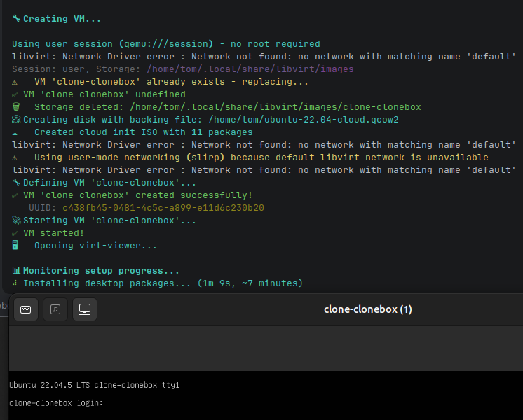

# CloneBox 📦

[](https://github.com/wronai/clonebox/actions)
[](https://pypi.org/project/clonebox/)
[](https://www.python.org/downloads/)
[](LICENSE)



```commandline
╔═══════════════════════════════════════════════════════╗
║     ____  _                    ____                   ║
║    / ___|| |  ___   _ __   ___|  _ \  ___ __  __      ║
║   | |    | | / _ \ | '_ \ / _ \ |_) |/ _ \\ \/ /      ║
║   | |___ | || (_) || | | |  __/  _ <| (_) |>  <       ║
║    \____||_| \___/ |_| |_|\___|_| \_\\___//_/\_\      ║
║                                                       ║
║      Clone your workstation to an isolated VM         ║
╚═══════════════════════════════════════════════════════╝
```

> **Clone your workstation environment to an isolated VM in 60 seconds using bind mounts instead of disk cloning.**

CloneBox lets you create isolated virtual machines with only the applications, directories and services you need - using bind mounts instead of full disk cloning. Perfect for development, testing, or creating reproducible environments.

## Features

- 🎯 **Selective cloning** - Choose exactly which paths, services and apps to include
- 🔍 **Auto-detection** - Automatically detects running services, applications, and project directories
- 🔗 **Bind mounts** - Share directories with the VM without copying data
- ☁️ **Cloud-init** - Automatic package installation and service setup
- 🖥️ **GUI support** - SPICE graphics with virt-viewer integration
- ⚡ **Fast creation** - No full disk cloning, VMs are ready in seconds
- 📥 **Auto-download** - Automatically downloads and caches Ubuntu cloud images (stored in ~/Downloads)
- 📊 **Health monitoring** - Built-in health checks for packages, services, and mounts
- 🔄 **Self-healing** - Automatic monitoring and repair of apps and services
- 📈 **Live monitoring** - Real-time dashboard for running applications and services
- 🔧 **Repair tools** - One-click fix for common VM issues (audio, permissions, mounts)
- 🔄 **VM migration** - Export/import VMs with data between workstations
- 🧪 **Configuration testing** - Validate VM settings and functionality
- 📁 **App data sync** - Include browser profiles, IDE settings, and app configs

### GUI - cloned ubuntu


## Use Cases

CloneBox excels in scenarios where developers need:
- Isolated sandbox environments for testing AI agents, edge computing simulations, or integration workflows without risking host system stability
- Reproducible development setups that can be quickly spun up with identical configurations across different machines
- Safe experimentation with system-level changes that can be discarded by simply deleting the VM
- Quick onboarding for new team members who need a fully configured development environment

## What's New in v1.1

**v1.1.2** is production-ready with two full runtimes and P2P secure sharing:

| Feature | Status |
|---------|--------|
| 🖥️ VM Runtime (libvirt/QEMU) | ✅ Stable |
| 🐳 Container Runtime (Podman/Docker) | ✅ Stable |
| 📊 Web Dashboard (FastAPI + HTMX + Tailwind) | ✅ Stable |
| 🎛️ Profiles System (`ml-dev`, `web-stack`) | ✅ Stable |
| 🔍 Auto-detection (services, apps, paths) | ✅ Stable |
| 🔒 P2P Secure Transfer (AES-256) | ✅ **NEW** |
| 🧪 95%+ Test Coverage | ✅ |

### P2P Secure VM Sharing

Share VMs between workstations with AES-256 encryption:

```bash
# Generate team encryption key (once per team)
clonebox keygen
# 🔑 Key saved: ~/.clonebox.key

# Export encrypted VM
clonebox export-encrypted my-dev-vm -o team-env.enc --user-data

# Transfer via SCP/SMB/USB
scp team-env.enc user@workstationB:~/

# Import on another machine (needs same key)
clonebox import-encrypted team-env.enc --name my-dev-copy

# Or use P2P commands directly
clonebox export-remote user@hostA my-vm -o local.enc --encrypted
clonebox import-remote local.enc user@hostB --encrypted
clonebox sync-key user@hostB  # Sync encryption key
clonebox list-remote user@hostB  # List remote VMs
```

### Roadmap

- **v1.2.0**: `clonebox exec` command, VM snapshots, snapshot restore
- **v1.3.0**: Multi-VM orchestration, cluster mode
- **v2.0.0**: Cloud provider support (AWS, GCP, Azure), Windows WSL2 support

See [TODO.md](TODO.md) for detailed roadmap and [CONTRIBUTING.md](CONTRIBUTING.md) for contribution guidelines.


CloneBox to narzędzie CLI do **szybkiego klonowania aktualnego środowiska workstation do izolowanej maszyny wirtualnej (VM)**. 
Zamiast pełnego kopiowania dysku, używa **bind mounts** (udostępnianie katalogów na żywo) i **cloud-init** do selektywnego przeniesienia tylko potrzebnych elementów: uruchomionych usług (Docker, PostgreSQL, nginx), aplikacji, ścieżek projektów i konfiguracji. Automatycznie pobiera obrazy Ubuntu, instaluje pakiety i uruchamia VM z SPICE GUI. Idealne dla deweloperów na Linuxie – VM powstaje w minuty, bez duplikowania danych.

Kluczowe komendy:
- `clonebox` – interaktywny wizard (detect + create + start)
- `clonebox detect` – skanuje usługi/apps/ścieżki
- `clonebox clone . --user --run` – szybki klon bieżącego katalogu z użytkownikiem i autostartem
- `clonebox watch . --user` – monitoruj na żywo aplikacje i usługi w VM
- `clonebox repair . --user` – napraw problemy z uprawnieniami, audio, usługami
- `clonebox container up|ps|stop|rm` – lekki runtime kontenerowy (podman/docker)
- `clonebox dashboard` – lokalny dashboard (VM + containers)

### Dlaczego wirtualne klony workstation mają sens?

**Problem**: Developerzy/Vibecoderzy nie izolują środowisk dev/test (np. dla AI agentów), bo ręczne odtwarzanie setupu to ból – godziny na instalację apps, usług, configów, dotfiles. Przechodzenie z fizycznego PC na VM wymagałoby pełnego rebuilda, co blokuje workflow.

**Rozwiązanie CloneBox**: Automatycznie **skanuje i klonuje stan "tu i teraz"** (usługi z `ps`, dockery z `docker ps`, projekty z git/.env). VM dziedziczy środowisko bez kopiowania całego śmietnika – tylko wybrane bind mounty. 

**Korzyści w twoim kontekście (embedded/distributed systems, AI automation)**:
- **Sandbox dla eksperymentów**: Testuj AI agenty, edge computing (RPi/ESP32 symulacje) czy Camel/ERP integracje w izolacji, bez psucia hosta.
- **Reprodukcja workstation**: Na firmowym PC masz setup z domu (Python/Rust/Go envs, Docker compose, Postgres dev DB) – klonujesz i pracujesz identycznie.
- **Szybkość > dotfiles**: Dotfiles odtwarzają configi, ale nie łapią runtime stanu (uruchomione serwery, otwarte projekty). CloneBox to "snapshot na sterydach".
- **Bezpieczeństwo/cost-optymalizacja**: Izolacja od plików hosta (tylko mounts), zero downtime, tanie w zasobach (libvirt/QEMU). Dla SME: szybki onboarding dev env bez migracji fizycznej.
- **AI-friendly**: Agenci LLMs (jak te z twoich hobby) mogą działać w VM z pełnym kontekstem, bez ryzyka "zasmiecania" main PC.

Przykład: Masz uruchomiony Kubernetes Podman z twoim home labem + projekt automotive leasing. `clonebox clone ~/projects --run` → VM gotowa w 30s, z tymi samymi serwisami, ale izolowana. Lepsze niż Docker (brak GUI/full OS) czy pełna migracja.

**Dlaczego ludzie tego nie robią?** Brak automatyzacji – nikt nie chce ręcznie rebuildować. 
- CloneBox rozwiązuje to jednym poleceniem. Super match dla twoich interesów (distributed infra, AI tools, business automation).


## Installation

### Quick Setup (Recommended)

Run the setup script to automatically install dependencies and configure the environment:

```bash
# Clone the repository
git clone https://github.com/wronai/clonebox.git
cd clonebox

# Run the setup script
./setup.sh
```

The setup script will:
- Install all required packages (QEMU, libvirt, Python, etc.)
- Add your user to the necessary groups
- Configure libvirt networks
- Install clonebox in development mode

### Manual Installation

#### Prerequisites

```bash
# Install libvirt and QEMU/KVM
sudo apt install qemu-kvm libvirt-daemon-system libvirt-clients bridge-utils virt-manager virt-viewer

# Enable and start libvirtd
sudo systemctl enable --now libvirtd

# Add user to libvirt group
sudo usermod -aG libvirt $USER
newgrp libvirt

# Install genisoimage for cloud-init
sudo apt install genisoimage
```

#### Install CloneBox

```bash
# From source
git clone https://github.com/wronai/clonebox.git
cd clonebox
pip install -e .

# Or directly
pip install clonebox
```

Dashboard ma opcjonalne zależności:
```bash
pip install "clonebox[dashboard]"
```
lub
```bash
# Aktywuj venv
source .venv/bin/activate

# Interaktywny tryb (wizard)
clonebox

# Lub poszczególne komendy
clonebox detect              # Pokaż wykryte usługi/apps/ścieżki
clonebox list                # Lista VM
clonebox create --config ... # Utwórz VM z JSON config
clonebox start <name>        # Uruchom VM
clonebox stop <name>         # Zatrzymaj VM
clonebox delete <name>       # Usuń VM
```

## Development and Testing

### Running Tests

CloneBox has comprehensive test coverage with unit tests and end-to-end tests:

```bash
# Run unit tests only (fast, no libvirt required)
make test

# Run fast unit tests (excludes slow tests)
make test-unit

# Run end-to-end tests (requires libvirt/KVM)
make test-e2e

# Run all tests including e2e
make test-all

# Run tests with coverage
make test-cov

# Run tests with verbose output
make test-verbose
```

### Test Categories

Tests are organized with pytest markers:

- **Unit tests**: Fast tests that mock libvirt/system calls (default)
- **E2E tests**: End-to-end tests requiring actual VM creation (marked with `@pytest.mark.e2e`)
- **Slow tests**: Tests that take longer to run (marked with `@pytest.mark.slow`)

E2E tests are automatically skipped when:
- libvirt is not installed
- `/dev/kvm` is not available
- Running in CI environment (`CI=true` or `GITHUB_ACTIONS=true`)

### Manual Test Execution

```bash
# Run only unit tests (exclude e2e)
pytest tests/ -m "not e2e"

# Run only e2e tests
pytest tests/e2e/ -m "e2e" -v

# Run specific test file
pytest tests/test_cloner.py -v

# Run with coverage
pytest tests/ -m "not e2e" --cov=clonebox --cov-report=html
```

## Quick Start

### Interactive Mode (Recommended)

Simply run `clonebox` to start the interactive wizard:

```bash
clonebox

clonebox clone . --user --run --replace --base-image ~/ubuntu-22.04-cloud.qcow2 --disk-size-gb 30
# Sprawdź diagnostykę na żywo
clonebox watch . --user

clonebox test . --user --validate --require-running-apps
# Uruchom pełną walidację (wykorzystuje QGA do sprawdzenia serwisów wewnątrz)
clonebox test . --user --validate --smoke-test
```

### Profiles (Reusable presets)

Profiles pozwalają trzymać gotowe presety dla VM/container (np. `ml-dev`, `web-dev`) i nakładać je na bazową konfigurację.

```bash
# Przykład: uruchom kontener z profilem
clonebox container up . --profile ml-dev --engine podman

# Przykład: generuj VM config z profilem
clonebox clone . --profile ml-dev --user --run
```

Domyślne lokalizacje profili:
- `~/.clonebox.d/<name>.yaml`
- `./.clonebox.d/<name>.yaml`
- wbudowane: `src/clonebox/templates/profiles/<name>.yaml`

### Dashboard

```bash
clonebox dashboard --port 8080
# http://127.0.0.1:8080
```

The wizard will:
1. Detect running services (Docker, PostgreSQL, nginx, etc.)
2. Detect running applications and their working directories
3. Detect project directories and config files
4. Let you select what to include in the VM
5. Create and optionally start the VM

### Command Line

```bash
# Create VM with specific config
clonebox create --name my-dev-vm --config '{
  "paths": {
    "/home/user/projects": "/mnt/projects",
    "/home/user/.config": "/mnt/config"
  },
  "packages": ["python3", "nodejs", "docker.io"],
  "services": ["docker"]
}' --ram 4096 --vcpus 4 --disk-size-gb 20 --start

# Create VM with larger root disk
clonebox create --name my-dev-vm --disk-size-gb 30 --config '{"paths": {}, "packages": [], "services": []}'

# List VMs
clonebox list

# Start/Stop VM
clonebox start my-dev-vm
clonebox stop my-dev-vm

# Delete VM
clonebox delete my-dev-vm

# Detect system state (useful for scripting)
clonebox detect --json
```

## Usage Examples

### Basic Workflow

```bash
# 1. Clone current directory with auto-detection
clonebox clone . --user

# 2. Review generated config
cat .clonebox.yaml

# 3. Create and start VM
clonebox start . --user --viewer

# 4. Check VM status
clonebox status . --user

# 5. Open VM window later
clonebox open . --user

# 6. Stop VM when done
clonebox stop . --user

# 7. Delete VM if needed
clonebox delete . --user --yes
```

### Development Environment with Browser Profiles

```bash
# Clone with app data (browser profiles, IDE settings)
clonebox clone . --user --run

# VM will have:
# - All your project directories
# - Browser profiles (Chrome, Firefox) with bookmarks and passwords
# - IDE settings (PyCharm, VSCode)
# - Docker containers and services

# Access in VM:
ls ~/.config/google-chrome  # Chrome profile

# Firefox profile (Ubuntu często używa snap):
ls ~/snap/firefox/common/.mozilla/firefox
ls ~/.mozilla/firefox

# PyCharm profile (snap):
ls ~/snap/pycharm-community/common/.config/JetBrains
ls ~/.config/JetBrains
```

### Container workflow (podman/docker)

```bash
# Start a dev container (auto-detect engine if not specified)
clonebox container up . --engine podman --detach

# List running containers
clonebox container ps

# Stop/remove
clonebox container stop <name>
clonebox container rm <name>
```

### Full validation (VM)

`clonebox test` weryfikuje, że VM faktycznie ma zamontowane ścieżki i spełnia wymagania z `.clonebox.yaml`.

```bash
clonebox test . --user --validate
```

Walidowane kategorie:
- **Mounts** (9p)
- **Packages** (apt)
- **Snap packages**
- **Services** (enabled + running)
- **Apps** (instalacja + dostępność profilu: Firefox/PyCharm/Chrome)

### Testing and Validating VM Configuration

```bash
# Quick test - basic checks
clonebox test . --user --quick

# Full validation - checks EVERYTHING against YAML config
clonebox test . --user --validate

# Validation checks:
# ✅ All mount points (paths + app_data_paths) are mounted and accessible
# ✅ All APT packages are installed
# ✅ All snap packages are installed
# ✅ All services are enabled and running
# ✅ Reports file counts for each mount
# ✅ Shows package versions
# ✅ Comprehensive summary table

# Example output:
# 💾 Validating Mount Points...
# ┌─────────────────────────┬─────────┬────────────┬────────┐
# │ Guest Path              │ Mounted │ Accessible │ Files  │
# ├─────────────────────────┼─────────┼────────────┼────────┤
# │ /home/ubuntu/Downloads  │ ✅      │ ✅         │ 199    │
# │ ~/.config/JetBrains     │ ✅      │ ✅         │ 45     │
# └─────────────────────────┴─────────┴────────────┴────────┘
# 12/14 mounts working
#
# 📦 Validating APT Packages...
# ┌─────────────────┬──────────────┬────────────┐
# │ Package         │ Status       │ Version    │
# ├─────────────────┼──────────────┼────────────┤
# │ firefox         │ ✅ Installed │ 122.0+b... │
# │ docker.io       │ ✅ Installed │ 24.0.7-... │
# └─────────────────┴──────────────┴────────────┘
# 8/8 packages installed
#
# 📊 Validation Summary
# ┌────────────────┬────────┬────────┬───────┐
# │ Category       │ Passed │ Failed │ Total │
# ├────────────────┼────────┼────────┼───────┤
# │ Mounts         │ 12     │ 2      │ 14    │
# │ APT Packages   │ 8      │ 0      │ 8     │
# │ Snap Packages  │ 2      │ 0      │ 2     │
# │ Services       │ 5      │ 1      │ 6     │
# │ TOTAL          │ 27     │ 3      │ 30    │
# └────────────────┴────────┴────────┴───────┘
```

### VM Health Monitoring and Mount Validation

```bash
# Check overall status including mount validation
clonebox status . --user

# Output shows:
# 📊 VM State: running
# 🔍 Network and IP address
# ☁️ Cloud-init: Complete
# 💾 Mount Points status table:
#    ┌─────────────────────────┬──────────────┬────────┐
#    │ Guest Path              │ Status       │ Files  │
#    ├─────────────────────────┼──────────────┼────────┤
#    │ /home/ubuntu/Downloads  │ ✅ Mounted   │ 199    │
#    │ /home/ubuntu/Documents  │ ❌ Not mounted│ ?     │
#    │ ~/.config/JetBrains     │ ✅ Mounted   │ 45     │
#    └─────────────────────────┴──────────────┴────────┘
#    12/14 mounts active
# 🏥 Health Check Status: OK

# Trigger full health check
clonebox status . --user --health

# If mounts are missing, remount or rebuild:
# In VM: sudo mount -a
# Or rebuild: clonebox clone . --user --run --replace
```

## 📊 Monitoring and Self-Healing

CloneBox includes continuous monitoring and automatic self-healing capabilities for both GUI applications and system services.

### Monitor Running Applications and Services

```bash
# Watch real-time status of apps and services
clonebox watch . --user

# Output shows live dashboard:
# ╔══════════════════════════════════════════════════════════╗
# ║                   CloneBox Live Monitor                  ║
# ╠══════════════════════════════════════════════════════════╣
# ║ 🖥️  GUI Apps:                                              ║
# ║   ✅ pycharm-community    PID: 1234   Memory: 512MB       ║
# ║   ✅ firefox             PID: 5678   Memory: 256MB       ║
# ║   ❌ chromium            Not running                    ║
# ║                                                          ║
# ║ 🔧 System Services:                                       ║
# ║   ✅ docker              Active: 2h 15m                ║
# ║   ✅ nginx               Active: 1h 30m                ║
# ║   ✅ uvicorn             Active: 45m (port 8000)       ║
# ║                                                          ║
# ║ 📊 Last check: 2024-01-31 13:25:30                       ║
# ║ 🔄 Next check in: 25 seconds                             ║
# ╚══════════════════════════════════════════════════════════╝

# Check detailed status with logs
clonebox status . --user --verbose

# View monitor logs from host
./scripts/clonebox-logs.sh  # Interactive log viewer
# Or via SSH:
ssh ubuntu@<IP_VM> "tail -f /var/log/clonebox-monitor.log"
```

### Repair and Troubleshooting

```bash
# Run automatic repair from host
clonebox repair . --user

# This triggers the repair script inside VM which:
# - Fixes directory permissions (pulse, ibus, dconf)
# - Restarts audio services (PulseAudio/PipeWire)
# - Reconnects snap interfaces
# - Remounts missing filesystems
# - Resets GNOME keyring if needed

# Interactive repair menu (via SSH)
ssh ubuntu@<IP_VM> "clonebox-repair"

# Manual repair options from host:
clonebox repair . --user --auto      # Full automatic repair
clonebox repair . --user --perms     # Fix permissions only
clonebox repair . --user --audio     # Fix audio only
clonebox repair . --user --snaps     # Reconnect snaps only
clonebox repair . --user --mounts    # Remount filesystems only

# Check repair status (via SSH)
ssh ubuntu@<IP_VM> "cat /var/run/clonebox-status"

# View repair logs
./scripts/clonebox-logs.sh  # Interactive viewer
# Or via SSH:
ssh ubuntu@<IP_VM> "tail -n 50 /var/log/clonebox-boot.log"
```

### Monitor Configuration

The monitoring system is configured through environment variables in `.env`:

```bash
# Enable/disable monitoring
CLONEBOX_ENABLE_MONITORING=true
CLONEBOX_MONITOR_INTERVAL=30      # Check every 30 seconds
CLONEBOX_AUTO_REPAIR=true         # Auto-restart failed services
CLONEBOX_WATCH_APPS=true          # Monitor GUI apps
CLONEBOX_WATCH_SERVICES=true      # Monitor system services
```

### Inside the VM - Manual Controls

```bash
# Check monitor service status
systemctl --user status clonebox-monitor

# View monitor logs
journalctl --user -u clonebox-monitor -f
tail -f /var/log/clonebox-monitor.log

# Stop/start monitoring
systemctl --user stop clonebox-monitor
systemctl --user start clonebox-monitor

# Check last status
cat /var/run/clonebox-monitor-status

# Run repair manually
clonebox-repair --all             # Run all fixes
clonebox-repair --status          # Show current status
clonebox-repair --logs            # Show recent logs
```

### Export/Import Workflow

```bash
# On workstation A - Export VM with all data
clonebox export . --user --include-data -o my-dev-env.tar.gz

# Transfer file to workstation B, then import
clonebox import my-dev-env.tar.gz --user

# Start VM on new workstation
clonebox start . --user
clonebox open . --user

# VM includes:
# - Complete disk image
# - All browser profiles and settings
# - Project files
# - Docker images and containers
```

### Troubleshooting Common Issues

```bash
# If mounts are empty after reboot:
clonebox status . --user  # Check VM status
# Then in VM:
sudo mount -a              # Remount all fstab entries

# If browser profiles don't sync:
rm .clonebox.yaml
clonebox clone . --user --run --replace

# If GUI doesn't open:
clonebox open . --user     # Easiest way
# or:
virt-viewer --connect qemu:///session clone-clonebox

# Check VM details:
clonebox list              # List all VMs
virsh --connect qemu:///session dominfo clone-clonebox

# Restart VM if needed:
clonebox restart . --user  # Easiest - stop and start
clonebox stop . --user && clonebox start . --user  # Manual restart
clonebox restart . --user --open  # Restart and open GUI
virsh --connect qemu:///session reboot clone-clonebox  # Direct reboot
virsh --connect qemu:///session reset clone-clonebox  # Hard reset if frozen
```

## Legacy Examples (Manual Config)

These examples use the older `create` command with manual JSON config. For most users, the `clone` command with auto-detection is easier.

### Python Development Environment

```bash
clonebox create --name python-dev --config '{
  "paths": {
    "/home/user/my-python-project": "/workspace",
    "/home/user/.pyenv": "/root/.pyenv"
  },
  "packages": ["python3", "python3-pip", "python3-venv", "build-essential"],
  "services": []
}' --ram 2048 --start
```

### Docker Development

```bash
clonebox create --name docker-dev --config '{
  "paths": {
    "/home/user/docker-projects": "/projects",
    "/var/run/docker.sock": "/var/run/docker.sock"
  },
  "packages": ["docker.io", "docker-compose"],
  "services": ["docker"]
}' --ram 4096 --start
```

### Full Stack (Node.js + PostgreSQL)

```bash
clonebox create --name fullstack --config '{
  "paths": {
    "/home/user/my-app": "/app",
    "/home/user/pgdata": "/var/lib/postgresql/data"
  },
  "packages": ["nodejs", "npm", "postgresql"],
  "services": ["postgresql"]
}' --ram 4096 --vcpus 4 --start
```

## Inside the VM

After the VM boots, shared directories are automatically mounted via fstab entries. You can check their status:

```bash
# Check mount status
mount | grep 9p

# View health check report
cat /var/log/clonebox-health.log

# Re-run health check manually
clonebox-health

# Check cloud-init status
sudo cloud-init status

# Manual mount (if needed)
sudo mkdir -p /mnt/projects
sudo mount -t 9p -o trans=virtio,version=9p2000.L,nofail mount0 /mnt/projects
```

### Health Check System

CloneBox includes automated health checks that verify:
- Package installation (apt/snap)
- Service status
- Mount points accessibility
- GUI readiness

Health check logs are saved to `/var/log/clonebox-health.log` with a summary in `/var/log/clonebox-health-status`.

## Architecture

```
┌────────────────────────────────────────────────────────┐
│                     HOST SYSTEM                        │
│  ┌──────────────┐  ┌──────────────┐  ┌──────────────┐  │
│  │ /home/user/  │  │  /var/www/   │  │   Docker     │  │
│  │  projects/   │  │    html/     │  │   Socket     │  │
│  └──────┬───────┘  └──────┬───────┘  └──────┬───────┘  │
│         │                 │                 │          │
│         │    9p/virtio    │                 │          │
│         │   bind mounts   │                 │          │
│  ┌──────▼─────────────────▼─────────────────▼───────┐  │
│  │               CloneBox VM                        │  │
│  │  ┌────────────┐ ┌────────────┐ ┌────────────┐    │  │
│  │  │ /mnt/proj  │ │ /mnt/www   │ │ /var/run/  │    │  │
│  │  │            │ │            │ │ docker.sock│    │  │
│  │  └────────────┘ └────────────┘ └────────────┘    │  │
│  │                                                  │  │
│  │  cloud-init installed packages & services        │  │
│  └──────────────────────────────────────────────────┘  │
└────────────────────────────────────────────────────────┘
```

## Quick Clone (Recommended)

The fastest way to clone your current working directory:

```bash
# Clone current directory - generates .clonebox.yaml and asks to create VM
# Base OS image is automatically downloaded to ~/Downloads on first run
clonebox clone .

# Increase VM disk size (recommended for GUI + large tooling)
clonebox clone . --user --disk-size-gb 30

# Clone specific path
clonebox clone ~/projects/my-app

# Clone with custom name and auto-start
clonebox clone ~/projects/my-app --name my-dev-vm --run

# Clone and edit config before creating
clonebox clone . --edit

# Replace existing VM (stops, deletes, and recreates)
clonebox clone . --replace

# Use custom base image instead of auto-download
clonebox clone . --base-image ~/ubuntu-22.04-cloud.qcow2

# User session mode (no root required)
clonebox clone . --user
```

Later, start the VM from any directory with `.clonebox.yaml`:

```bash
# Start VM from config in current directory
clonebox start .

# Start VM from specific path
clonebox start ~/projects/my-app
```

### Export YAML Config

```bash
# Export detected state as YAML (with deduplication)
clonebox detect --yaml --dedupe

# Save to file
clonebox detect --yaml --dedupe -o my-config.yaml
```

### Base Images

CloneBox automatically downloads a bootable Ubuntu cloud image on first run:

```bash
# Auto-download (default) - downloads Ubuntu 22.04 to ~/Downloads on first run
clonebox clone .

# Use custom base image
clonebox clone . --base-image ~/my-custom-image.qcow2

# Manual download (optional - clonebox does this automatically)
wget -O ~/Downloads/clonebox-ubuntu-jammy-amd64.qcow2 \
  https://cloud-images.ubuntu.com/jammy/current/jammy-server-cloudimg-amd64.img
```

**Base image behavior:**
- If no `--base-image` is specified, Ubuntu 22.04 cloud image is auto-downloaded
- Downloaded images are cached in `~/Downloads/clonebox-ubuntu-jammy-amd64.qcow2`
- Subsequent VMs reuse the cached image (no re-download)
- Each VM gets its own disk using the base image as a backing file (copy-on-write)

### VM Login Credentials

VM credentials are managed through `.env` file for security:

**Setup:**
1. Copy `.env.example` to `.env`:
   ```bash
   cp .env.example .env
   ```

2. Edit `.env` and set your password:
   ```bash
   # .env file
   VM_PASSWORD=your_secure_password
   VM_USERNAME=ubuntu
   ```

3. The `.clonebox.yaml` file references the password from `.env`:
   ```yaml
   vm:
     username: ubuntu
     password: ${VM_PASSWORD}  # Loaded from .env
   ```

**Default credentials (if .env not configured):**
- **Username:** `ubuntu`
- **Password:** `ubuntu`

**Security notes:**
- `.env` is automatically gitignored (never committed)
- Username is stored in YAML (not sensitive)
- Password is stored in `.env` (sensitive, not committed)
- Change password after first login: `passwd`
- User has passwordless sudo access

### User Session & Networking

CloneBox supports creating VMs in user session (no root required) with automatic network fallback:

```bash
# Create VM in user session (uses ~/.local/share/libvirt/images)
clonebox clone . --user

# Explicitly use user-mode networking (slirp) - works without libvirt network
clonebox clone . --user --network user

# Force libvirt default network (may fail in user session)
clonebox clone . --network default

# Auto mode (default): tries libvirt network, falls back to user-mode if unavailable
clonebox clone . --network auto
```

**Network modes:**
- `auto` (default): Uses libvirt default network if available, otherwise falls back to user-mode (slirp)
- `default`: Forces use of libvirt default network
- `user`: Uses user-mode networking (slirp) - no bridge setup required

## Commands Reference

| Command | Description |
|---------|-------------|
| `clonebox` | Interactive VM creation wizard |
| `clonebox clone <path>` | Generate `.clonebox.yaml` from path + running processes |
| `clonebox clone . --run` | Clone and immediately start VM |
| `clonebox clone . --edit` | Clone, edit config, then create |
| `clonebox clone . --replace` | Replace existing VM (stop, delete, recreate) |
| `clonebox clone . --user` | Clone in user session (no root) |
| `clonebox clone . --base-image <path>` | Use custom base image |
| `clonebox clone . --disk-size-gb <gb>` | Set root disk size in GB (generated configs default to 20GB) |
| `clonebox clone . --network user` | Use user-mode networking (slirp) |
| `clonebox clone . --network auto` | Auto-detect network mode (default) |
| `clonebox create --config <json> --disk-size-gb <gb>` | Create VM from JSON config with specified disk size |
| `clonebox start .` | Start VM from `.clonebox.yaml` in current dir |
| `clonebox start . --viewer` | Start VM and open GUI window |
| `clonebox start <name>` | Start existing VM by name |
| `clonebox stop .` | Stop VM from `.clonebox.yaml` in current dir |
| `clonebox stop . -f` | Force stop VM |
| `clonebox delete .` | Delete VM from `.clonebox.yaml` in current dir |
| `clonebox delete . --yes` | Delete VM without confirmation |
| `clonebox list` | List all VMs |
| `clonebox detect` | Show detected services/apps/paths |
| `clonebox detect --yaml` | Output as YAML config |
| `clonebox detect --yaml --dedupe` | YAML with duplicates removed |
| `clonebox detect --json` | Output as JSON |
| `clonebox container up .` | Start a dev container for given path |
| `clonebox container ps` | List containers |
| `clonebox container stop <name>` | Stop a container |
| `clonebox container rm <name>` | Remove a container |
| `clonebox dashboard` | Run local dashboard (VM + containers) |
| `clonebox status . --user` | Check VM health, cloud-init, IP, and mount status |
| `clonebox status . --user --health` | Check VM status and run full health check |
| `clonebox test . --user` | Test VM configuration (basic checks) |
| `clonebox test . --user --validate` | Full validation: mounts, packages, services vs YAML |
| `clonebox export . --user` | Export VM for migration to another workstation |
| `clonebox export . --user --include-data` | Export VM with browser profiles and configs |
| `clonebox import archive.tar.gz --user` | Import VM from export archive |
| `clonebox open . --user` | Open GUI viewer for VM (same as virt-viewer) |
| `virt-viewer --connect qemu:///session <vm>` | Open GUI for running VM |
| `virsh --connect qemu:///session console <vm>` | Open text console (Ctrl+] to exit) |

## Requirements

- Linux with KVM support (`/dev/kvm`)
- libvirt daemon running
- Python 3.8+
- User in `libvirt` group

## Troubleshooting

### Critical: Insufficient Disk Space

If you install a full desktop environment and large development tools (e.g. `ubuntu-desktop-minimal`, `docker.io`, large snaps like `pycharm-community`/`chromium`), you may hit low disk space warnings inside the VM.

Recommended fix:
- Set a larger root disk in `.clonebox.yaml`:

```yaml
vm:
  disk_size_gb: 30
```

You can also set it during config generation:
```bash
clonebox clone . --user --disk-size-gb 30
```

Notes:
- New configs generated by `clonebox clone` default to `disk_size_gb: 20`.
- You can override this by setting `vm.disk_size_gb` in `.clonebox.yaml`.

Workaround for an existing VM (host-side resize + guest filesystem grow):
```bash
clonebox stop . --user
qemu-img resize ~/.local/share/libvirt/images/<vm-name>/root.qcow2 +10G
clonebox start . --user
```

Inside the VM:
```bash
sudo growpart /dev/vda 1
sudo resize2fs /dev/vda1
df -h /
```

### Known Issue: IBus Preferences crash

During validation you may occasionally see a crash dialog from **IBus Preferences** in the Ubuntu desktop environment.
This is an upstream issue related to the input method daemon (`ibus-daemon`) and obsolete system packages (e.g. `libglib2.0`, `libssl3`, `libxml2`, `openssl`).
It does **not** affect CloneBox functionality and the VM operates normally.

Workaround:
- Dismiss the crash dialog
- Or run `sudo apt upgrade` inside the VM to update system packages

### Snap Apps Not Launching (PyCharm, Chromium, Firefox)

If snap-installed applications (e.g., PyCharm, Chromium) are installed but don't launch when clicked, the issue is usually **disconnected snap interfaces**. This happens because snap interfaces are not auto-connected when installing via cloud-init.

**New VMs created with updated CloneBox automatically connect snap interfaces**, but for older VMs or manual installs:

```bash
# Check snap interface connections
snap connections pycharm-community

# If you see "-" instead of ":desktop", interfaces are NOT connected

# Connect required interfaces
sudo snap connect pycharm-community:desktop :desktop
sudo snap connect pycharm-community:desktop-legacy :desktop-legacy
sudo snap connect pycharm-community:x11 :x11
sudo snap connect pycharm-community:wayland :wayland
sudo snap connect pycharm-community:home :home
sudo snap connect pycharm-community:network :network

# Restart snap daemon and try again
sudo systemctl restart snapd
snap run pycharm-community
```

**For Chromium/Firefox:**
```bash
sudo snap connect chromium:desktop :desktop
sudo snap connect chromium:x11 :x11
sudo snap connect firefox:desktop :desktop
sudo snap connect firefox:x11 :x11
```

**Debug launch:**
```bash
PYCHARM_DEBUG=true snap run pycharm-community 2>&1 | tee /tmp/pycharm-debug.log
```

**Nuclear option (reinstall):**
```bash
snap remove pycharm-community
rm -rf ~/snap/pycharm-community
sudo snap install pycharm-community --classic
sudo snap connect pycharm-community:desktop :desktop
```

### Network Issues

If you encounter "Network not found" or "network 'default' is not active" errors:

```bash
# Option 1: Use user-mode networking (no setup required)
clonebox clone . --user --network user

# Option 2: Run the network fix script
./fix-network.sh

# Or manually fix:
virsh --connect qemu:///session net-destroy default 2>/dev/null
virsh --connect qemu:///session net-undefine default 2>/dev/null
virsh --connect qemu:///session net-define /tmp/default-network.xml
virsh --connect qemu:///session net-start default
```

### Permission Issues

If you get permission errors:

```bash
# Ensure user is in libvirt and kvm groups
sudo usermod -aG libvirt $USER
sudo usermod -aG kvm $USER

# Log out and log back in for groups to take effect
```

### VM Already Exists

If you get "VM already exists" error:

```bash
# Option 1: Use --replace flag to automatically replace it
clonebox clone . --replace

# Option 2: Delete manually first
clonebox delete <vm-name>

# Option 3: Use virsh directly
virsh --connect qemu:///session destroy <vm-name>
virsh --connect qemu:///session undefine <vm-name>

# Option 4: Start the existing VM instead
clonebox start <vm-name>
```

### virt-viewer not found

If GUI doesn't open:

```bash
# Install virt-viewer
sudo apt install virt-viewer

# Then connect manually
virt-viewer --connect qemu:///session <vm-name>
```

### Browser Profiles and PyCharm Not Working

If browser profiles or PyCharm configs aren't available, or you get permission errors:

**Root cause:** VM was created with old version without proper mount permissions.

**Solution - Rebuild VM with latest fixes:**

```bash
# Stop and delete old VM
clonebox stop . --user
clonebox delete . --user --yes

# Recreate VM with fixed permissions and app data mounts
clonebox clone . --user --run --replace
```

**After rebuild, verify mounts in VM:**
```bash
# Check all mounts are accessible
ls ~/.config/google-chrome      # Chrome profile
ls ~/.mozilla/firefox           # Firefox profile  
ls ~/.config/JetBrains         # PyCharm settings
ls ~/Downloads                 # Downloads folder
ls ~/Documents                 # Documents folder
```

**What changed in v0.1.12:**
- All mounts use `uid=1000,gid=1000` for ubuntu user access
- Both `paths` and `app_data_paths` are properly mounted
- No sudo needed to access any shared directories

### Mount Points Empty or Permission Denied

If you get "must be superuser to use mount" error when accessing Downloads/Documents:

**Solution:** VM was created with old mount configuration. Recreate VM:

```bash
# Stop and delete old VM
clonebox stop . --user
clonebox delete . --user --yes

# Recreate with fixed permissions
clonebox clone . --user --run --replace
```

**What was fixed:**
- Mounts now use `uid=1000,gid=1000` so ubuntu user has access
- No need for sudo to access shared directories
- Applies to new VMs created after v0.1.12

### Mount Points Empty After Reboot

If shared directories appear empty after VM restart:

1. **Check fstab entries:**
   ```bash
   cat /etc/fstab | grep 9p
   ```

2. **Mount manually:**
   ```bash
   sudo mount -a
   ```

3. **Verify access mode:**
   - VMs created with `accessmode="mapped"` allow any user to access mounts
   - Mount options include `uid=1000,gid=1000` for user access

## Advanced Usage

### VM Migration Between Workstations

Export your complete VM environment:

```bash
# Export VM with all data
clonebox export . --user --include-data -o my-dev-env.tar.gz

# Transfer to new workstation, then import
clonebox import my-dev-env.tar.gz --user
clonebox start . --user
```

### Testing VM Configuration

Validate your VM setup:

```bash
# Quick test (basic checks)
clonebox test . --user --quick

# Full test (includes health checks)
clonebox test . --user --verbose
```

### Monitoring VM Health

Check VM status from workstation:

```bash
# Check VM state, IP, cloud-init, and health
clonebox status . --user

# Trigger health check in VM
clonebox status . --user --health
```

### Reopening VM Window

If you close the VM window, you can reopen it:

```bash
# Open GUI viewer (easiest)
clonebox open . --user

# Start VM and open GUI (if VM is stopped)
clonebox start . --user --viewer

# Open GUI for running VM
virt-viewer --connect qemu:///session clone-clonebox

# List VMs to get the correct name
clonebox list

# Text console (no GUI)
virsh --connect qemu:///session console clone-clonebox
# Press Ctrl + ] to exit console
```

## Exporting to Proxmox

To use CloneBox VMs in Proxmox, you need to convert the qcow2 disk image to Proxmox format.

### Step 1: Locate VM Disk Image

```bash
# Find VM disk location
clonebox list

# Check VM details for disk path
virsh --connect qemu:///session dominfo clone-clonebox

# Typical locations:
# User session: ~/.local/share/libvirt/images/<vm-name>/<vm-name>.qcow2
# System session: /var/lib/libvirt/images/<vm-name>/<vm-name>.qcow2
```

### Step 2: Export VM with CloneBox

```bash
# Export VM with all data (from current directory with .clonebox.yaml)
clonebox export . --user --include-data -o clonebox-vm.tar.gz

# Or export specific VM by name
clonebox export safetytwin-vm --include-data -o safetytwin.tar.gz

# Extract to get the disk image
tar -xzf clonebox-vm.tar.gz
cd clonebox-clonebox
ls -la  # Should show disk.qcow2, vm.xml, etc.
```

### Step 3: Convert to Proxmox Format

```bash
# Install qemu-utils if not installed
sudo apt install qemu-utils

# Convert qcow2 to raw format (Proxmox preferred)
qemu-img convert -f qcow2 -O raw disk.qcow2 vm-disk.raw

# Or convert to qcow2 with compression for smaller size
qemu-img convert -f qcow2 -O qcow2 -c disk.qcow2 vm-disk-compressed.qcow2
```

### Step 4: Transfer to Proxmox Host

```bash
# Using scp (replace with your Proxmox host IP)
scp vm-disk.raw root@proxmox:/var/lib/vz/template/iso/

# Or using rsync for large files
rsync -avh --progress vm-disk.raw root@proxmox:/var/lib/vz/template/iso/
```

### Step 5: Create VM in Proxmox

1. **Log into Proxmox Web UI**

2. **Create new VM:**
   - Click "Create VM"
   - Enter VM ID and Name
   - Set OS: "Do not use any media"

3. **Configure Hardware:**
   - **Hard Disk:** 
     - Delete default disk
     - Click "Add" → "Hard Disk"
     - Select your uploaded image file
     - Set Disk size (can be larger than image)
     - Set Bus: "VirtIO SCSI"
     - Set Cache: "Write back" for better performance

4. **CPU & Memory:**
   - Set CPU cores (match original VM config)
   - Set Memory (match original VM config)

5. **Network:**
   - Set Model: "VirtIO (paravirtualized)"

6. **Confirm:** Click "Finish" to create VM

### Step 6: Post-Import Configuration

1. **Start the VM in Proxmox**

2. **Update network configuration:**
   ```bash
   # In VM console, update network interfaces
   sudo nano /etc/netplan/01-netcfg.yaml
   
   # Example for Proxmox bridge:
   network:
     version: 2
     renderer: networkd
     ethernets:
       ens18:  # Proxmox typically uses ens18
         dhcp4: true
   ```

3. **Apply network changes:**
   ```bash
   sudo netplan apply
   ```

4. **Update mount points (if needed):**
   ```bash
   # Mount points will fail in Proxmox, remove them
   sudo nano /etc/fstab
   # Comment out or remove 9p mount entries
   
   # Reboot to apply changes
   sudo reboot
   ```

### Alternative: Direct Import to Proxmox Storage

If you have Proxmox with shared storage:

```bash
# On Proxmox host
# Create a temporary directory
mkdir /tmp/import

# Copy disk directly to Proxmox storage (example for local-lvm)
scp vm-disk.raw root@proxmox:/tmp/import/

# On Proxmox host, create VM using CLI
qm create 9000 --name clonebox-vm --memory 4096 --cores 4 --net0 virtio,bridge=vmbr0

# Import disk to VM
qm importdisk 9000 /tmp/import/vm-disk.raw local-lvm

# Attach disk to VM
qm set 9000 --scsihw virtio-scsi-pci --scsi0 local-lvm:vm-9000-disk-0

# Set boot disk
qm set 9000 --boot c --bootdisk scsi0
```

### Troubleshooting

- **VM won't boot:** Check if disk format is compatible (raw is safest)
- **Network not working:** Update network configuration for Proxmox's NIC naming
- **Performance issues:** Use VirtIO drivers and set cache to "Write back"
- **Mount errors:** Remove 9p mount entries from /etc/fstab as they won't work in Proxmox

### Notes

- CloneBox's bind mounts (9p filesystem) are specific to libvirt/QEMU and won't work in Proxmox
- Browser profiles and app data exported with `--include-data` will be available in the VM disk
- For shared folders in Proxmox, use Proxmox's shared folders or network shares instead

## License

Apache License - see [LICENSE](LICENSE) file.
